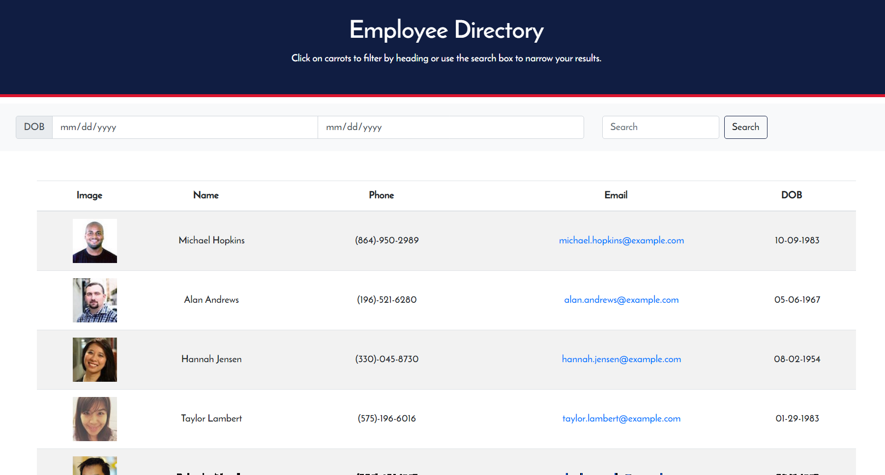

# Employee-Directory-

This React app utilizes an API to grab random users and make a directory, where other users can search for a "first name" that returns the user(s) with a matching first name from the directory. The directory contains user information such as an image, name, phone, email, and DOB. Users are also able to search through the directory with a DOB range. 

## Links
* https://morning-shelf-01044.herokuapp.com